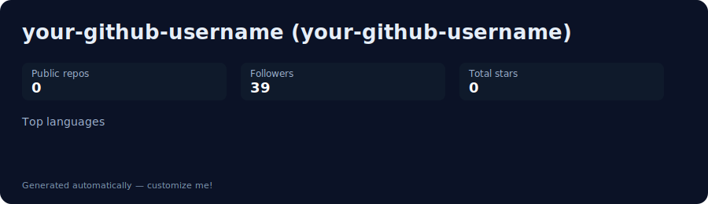

<!-- README.md — "World's Richest" profile for ErenYeager01001A -->

  

<h1 align="center">Arise JiNeeN ✦ ErenYeager01001A</h1>

“Hard work is worthless for those that don't believe in themselves.”

  <!-- The Matrix-style gif you provided -->
  

---

## 🌐 World’s Richest — Snapshot

   
  
  
  
  

> 💠 *This profile is styled as a posh "rich" dashboard — add your own metrics SVG (`github-metrics.svg`) to show live stats below.*

---

## ✨ Highlights
- 🏆 Collector of ideas, repos & midnight code
- 📚 Currently learning: Advanced Python + ML basics
- 🔭 Working on: a small projects/learning repo (see pinned)
- 🤝 Open to collab: small tools & scripts, bots
- 🎧 Mood: lo-fi + synthwave (match the world-rich Matrix gif)

---

## 📊 My Custom GitHub Metrics
> (Replace `./github-metrics.svg` with the SVG your action/script generates.)

---

## 🧾 Top Repos
> (Pin these or add automatically — replace with your real repo links)

- **ErenYeager01001A** — Hi! — `Python`  
- **project-idea-1** — Playground / experiments  
- **dotfiles** — setup & configs

---

## 🎖 Achievements & Fun Stuff
- 🪙 Collector of tiny wins: daily commits streaks, micro features, toy projects  
- 🎴 Fun fact: I treat GitHub like a personal vault — each repo is a story

---

## 📫 Contact
- GitHub: `@ErenYeager01001A`
- Email: (put your contact here)
- Twitter / Mastodon / Matrix: (optional links)

---

## 🔧 Want this to look even richer?
- Add a generated `github-metrics.svg` (I can generate a custom one for you).  
- Add a 3D contribution map or a dynamic Spotify card.  
- Use animated SVG icons or star counters that update via Actions.

---

If you want, I can:
1. Generate a polished `github-metrics.svg` (with avatar, top repos, followers, stars, languages).  
2. Replace the placeholder badges with real dynamic badges (followers, stars, repo counts).  
3. Convert this layout into a glass/neon style variant (to match the Matrix gif).

Tell me **which** of the three you want next and I’ll produce the exact files (SVG + GitHub Action YAML + final README) ready to paste.
