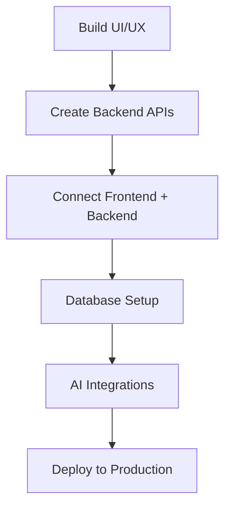

# 👋 Hi, I'm **Thakor**

---

## 🚀 **Full‑Stack Developer | AI & Automation Enthusiast | DevOps Learner**

I build modern web apps, AI-powered tools, dashboards, and automated systems using powerful and scalable technologies.

---

## 🧠 **Tech Stack & Skills**

### **Languages & Frameworks (With Icons)**

---

## 🤖 **AI & Research (Separate)**

I actively explore and build with modern AI — from prompt engineering to full LLM pipelines and research-driven model improvements. Below are the main AI areas I work on and study:

* 🔬 **Research & Experimentation** — reading papers, reproducing results, and testing new model ideas.
* 🧭 **LLM Development & Fine-tuning** — adapting models to tasks, instruction-tuning and RLHF concepts.
* 🧠 **Prompt Engineering & Chains** — designing reliable prompts, tool-usage chains, and orchestration (LangChain-style).
* ⚙️ **Model Deployment & Serving** — containerized model serving, low-latency endpoints, model versioning.
* 🔗 **Tooling & Integrations** — Hugging Face, OpenAI APIs, vectorDBs, embeddings, and retrieval-augmented pipelines.
* 🛡️ **Responsible AI** — bias checks, safety layers, and user-aligned behaviors.

> **Motivation / Vibe:**
>
> **"Code is a tool — don’t get stuck writing every line. Teach AI well, automate repetitive work, and focus on the real goal. AI will help write the code; you focus on the vision."**
>
> *Hindi:* *"AI field mein code pe poora depend mat raho — AI code likh dega. Vibe: coding se hatkar apne goal par focus karo.*"

---

## 🏗️ **What I Build**

* Modern UI/UX web apps
* Admin dashboards
* Anime / streaming platforms
* AI tools & automation workflows
* Full‑stack applications with complete backend + frontend

---

## 📦 **My Development Workflow**

---

## 📈 **GitHub Stats**

---

## 🧰 **Tools I Use Daily**

* VS Code
* Git & GitHub
* Postman
* Docker Desktop
* XAMPP
* Figma

---

## 🌐 **Connect With Me**

* 🔗 Portfolio: *(Add here)*
* 💼 LinkedIn: *(Add here)*
* 🧵 Twitter: *(Add here)*

---

---

## 🔗 **Social Icons & Links**

---

## 💬 **Saitama Motivation Quote (One Punch Man)**

> **“When you become strong… you lose your ability to feel fear. But you also lose excitement.”** — *Saitama*

🔥 *This reminds me that real growth comes from pushing limits, learning daily, and challenging yourself.*

---

### ⭐ If you like my work, don't forget to star my repositories!
